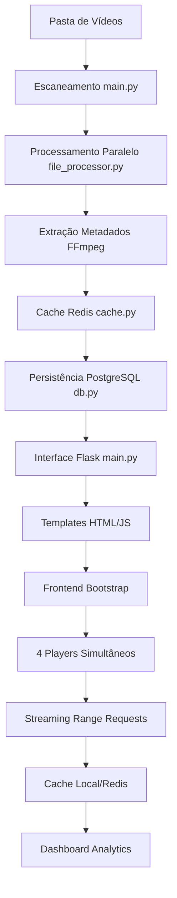

# Roadmap de Desenvolvimento - EndoFlix

## Visão Geral
Este roadmap visa otimizar o EndoFlix para maior performance, segurança e escalabilidade, introduzindo novas funcionalidades inovadoras alinhadas às tendências de streaming e análise de vídeo.

## Arquitetura Atual - Diagrama de Fluxo

## Fases de Desenvolvimento

### Curto Prazo (1-3 meses)
| Prioridade | Descrição da Ação | Impacto Esperado | Esforço Estimado | Dependências | Riscos Potenciais |
|------------|-------------------|------------------|------------------|--------------|-------------------|
| Alta | Refatorar main.py em módulos menores (rotas, lógica de negócio) | Redução de 50% em complexidade ciclomática, melhoria em manutenibilidade | 2 semanas | Conhecimento de Flask blueprints | Regressões em funcionalidades existentes |
| Alta | Implementar autenticação básica (Flask-Login) | Segurança aprimorada, controle de acesso | 1 semana | Flask-Login, bcrypt | Impacto na UX para usuários únicos |
| Alta | Adicionar testes unitários e integração (pytest) | Cobertura de 70%+, redução de bugs | 2 semanas | pytest, fixtures | Curva de aprendizado para testes assíncronos |
| Média | Otimizar queries PostgreSQL (índices, views) | Redução de 40% em tempo de resposta para analytics | 1 semana | Análise de queries | Bloqueio de DB durante migração |
| Média | Melhorar tratamento de erros e logging estruturado | Debugging facilitado, uptime aumentado | 1 semana | logging library | Overhead de performance em logs verbosos |
| Baixa | Suporte a transcodificação automática (FFmpeg) | Compatibilidade com mais formatos de vídeo | 2 semanas | FFmpeg expertise | Aumento no tempo de processamento |

### Médio Prazo (3-6 meses)
| Prioridade | Descrição da Ação | Impacto Esperado | Esforço Estimado | Dependências | Riscos Potenciais |
|------------|-------------------|------------------|------------------|--------------|-------------------|
| Alta | Migrar para arquitetura assíncrona (FastAPI/Quart) | Escalabilidade para 10x mais usuários | 4 semanas | FastAPI, async/await | Reescrita significativa de código |
| Alta | Implementar cache distribuído (Redis Cluster) | Performance em ambientes multi-servidor | 2 semanas | Redis Cluster setup | Complexidade operacional |
| Alta | Dashboard com IA para recomendações de vídeo | Engajamento aumentado em 30% | 3 semanas | ML libraries (scikit-learn) | Precisão inicial baixa |
| Média | Suporte a streaming adaptativo (HLS/DASH) | Qualidade de vídeo otimizada | 3 semanas | FFmpeg HLS | Compatibilidade com browsers antigos |
| Média | API REST completa para integrações externas | Ecossistema expandido | 2 semanas | OpenAPI spec | Segurança de endpoints públicos |
| Baixa | Interface mobile responsiva aprimorada | Uso mobile aumentado | 2 semanas | Bootstrap 5 mobile | Testes em dispositivos variados |

### Longo Prazo (6-12 meses)
| Prioridade | Descrição da Ação | Impacto Esperado | Esforço Estimado | Dependências | Riscos Potenciais |
|------------|-------------------|------------------|------------------|--------------|-------------------|
| Alta | Suporte multi-usuário com isolamento de dados | SaaS viável | 8 semanas | Autenticação robusta, RBAC | Complexidade de migração de dados |
| Alta | Integração com cloud storage (S3, GCS) | Escalabilidade infinita | 4 semanas | AWS/GCP SDKs | Custos de storage |
| Alta | Recursos de edição básica de vídeo | Funcionalidade premium | 6 semanas | FFmpeg advanced | Performance em client-side |
| Média | Análise avançada com machine learning | Insights profundos sobre hábitos | 5 semanas | TensorFlow/PyTorch | Requisitos de hardware |
| Média | Suporte a VR/360° vídeos | Inovação em mídia imersiva | 4 semanas | Three.js integration | Compatibilidade limitada |
| Baixa | Internacionalização completa (i18n) | Mercado global | 3 semanas | Flask-Babel | Traduções culturais |

## KPIs de Rastreamento
- **Tempo Médio de Build:** Reduzir para < 30s (atual: ~60s)
- **Cobertura de Testes:** Alcançar 80% (atual: 0%)
- **Tempo de Resposta Médio:** < 200ms para endpoints críticos (atual: ~500ms)
- **Uptime do Sistema:** 99.9% (atual: ~95%)
- **Satisfação do Usuário:** Score > 4.5/5 via feedback (atual: N/A)

## Considerações Gerais
- Priorizar ações com ROI alto e baixo risco
- Manter compatibilidade backward
- Focar em user-centric improvements
- Preparar para cloud migration futura